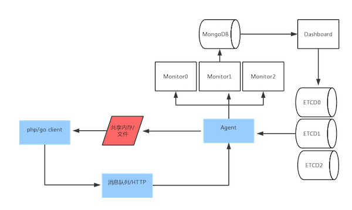

#Gconfd 配置中心

----------

##简介
golang+etcd语言实现的配置中心功能，客户端目前支持php和golang

----------

##架构图

----------

## 编译安装

1,源码编译

    git clone https://github.com/Leon2012/goconfd
    cd goconfd
    make

2,安装etcd

    DOWNLOAD_URL=https://github.com/coreos/etcd/releases/download
    curl -L ${DOWNLOAD_URL}/${ETCD_VER}/etcd-${ETCD_VER}-linux-amd64.tar.gz -o /tmp/etcd-${ETCD_VER}-linux-amd64.tar.gz
    mkdir -p /tmp/test-etcd && tar xzvf     /tmp/etcd-${ETCD_VER}-linux-amd64.tar.gz -C /tmp/test-etcd --strip-components=1

##使用

1,启动etcd

    /tmp/etcd
    
2,编辑agent.toml

    hosts = "localhost:2379" #etcd监听地址
    save_type=1              #kv保存类型，1为文件，2为共享内存
    save_path = "/tmp/goconfd" #kv文件保存目录 
    file_ext = "php"           #kv文件保存类型，目前支持php或json
    key_prefix= "develop.activity" #监听kv前缀
    heartbeat_interval=30  #agent发送心跳包的间隔 

3,启动

    cd build
    ./agent --config agent.toml 
    ./monitor --config monitor.toml
    ./dashboard --config dashboard.toml
    
4, 打开dashboard
[打开dashboard][1]

----------

##SDK

1,php

    composer require leon2012/goconfd-php-sdk
    include_once("../vendor/autoload.php");
    use goconfd\phpsdk\Goconfd;
    $config = [
        'save_path' => '/tmp/goconfd',
        'key_prefix' => 'develop.activity',
    ];
    $sdk = new Goconfd($config);
    $kv = $sdk->get("develop.activity.k1");
    if ($kv) {
        echo $kv->getValue();
    }
    
2, GO

    go get -u github.com/Leon2012/goconfd
    import(
        "github.com/Leon2012/goconfd/sdk"
        "fmt"
    )
    gconfd, err := sdk.NewGoconfd()
    if err != nil {
        fmt.Println(err)
    }
    k, err := gconfd.Get("develop.activity.k1")
    if err != nil {
        fmt.Println(err)
    }else{
        fmt.Println(k.Value)
    }